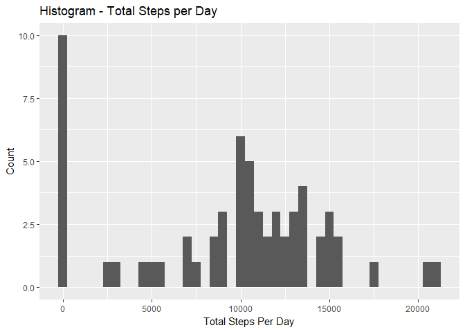

# Reproducible Research: Peer Assessment 1

### Introduction

This is an R Markdown document will describe the steps used to complete Peer Assignment #1 for Coursera Course entitled "Reproducible Research Peer Assignment 1". 

This work was done with significant contributions from the Stackoverflow.com website [link](https://stackoverflow.com/questions/). 

The data for this assignment can be downloaded from the course web site.  The name of the data file is "activity.csv". The dataset is stored in a comma-separated-value (CSV) file and there are a total of 17,568 observations in this dataset.

The variables included in this dataset are:

* steps: Number of steps taking in a 5-minute interval (missing values are coded as NA)
* date: The date on which the measurement was taken in YYYY-MM-DD format
* interval: Identifier for the 5-minute interval in which measurement was taken

### Loading and preprocessing the data

This R code will read the content of the Activity.csv file into the data set "activity".  The R code performs data manipulations for subsequent analyses. 


```r
install.packages("ggplot2", repos="http://cran.us.r-project.org")
```

```
## Installing package into 'C:/Users/jeanp/OneDrive/Documents/R/win-library/3.3'
## (as 'lib' is unspecified)
```

```
## package 'ggplot2' successfully unpacked and MD5 sums checked
## 
## The downloaded binary packages are in
## 	C:\Users\jeanp\AppData\Local\Temp\RtmpkpV3yh\downloaded_packages
```

```r
library(ggplot2)
```

```
## Warning: package 'ggplot2' was built under R version 3.3.3
```

```r
activity <- read.csv("~/R/Reproducible Research/activity.csv")
```

### What is mean total number of steps taken per day?

In this section, we compute the total steps by day and mean steps by intervals


```r
#***********************************************************************
#*  Compute Sum total steps by day and Mean Steps by intervals
#***********************************************************************

Total.Steps.By.Day<-tapply(activity$steps, activity$date, sum, na.rm=TRUE)
Mean.Steps.By.Interval.Day<-aggregate(steps~interval,data=activity,mean)

#**********************************************************************
#* Plot the Histogram of Total Steps by Day
#**********************************************************************

qplot(Total.Steps.By.Day, xlab="Total Steps Per Day", ylab="Count", main="Histogram - Total Steps per Day", binwidth=500)
```

<!-- -->

### Calculate and report the mean and median of the total number of steps taken per day

```r
#* The mean of Total Steps by Day is:
mean(Total.Steps.By.Day)
```

```
## [1] 9354.23
```

```r
#* The median of Total Steps by Day is:
median(Total.Steps.By.Day)
```

```
## [1] 10395
```


### Time series plot of average number of steps taken across all days vs. 5-minute interval

```r
plot(Mean.Steps.By.Interval.Day$interval, Mean.Steps.By.Interval.Day$steps, type="l", xlab="5 Min Interval", ylab="Mean Steps by Interval Across Days", main="Time Series Plot Mean Steps vs. Interval")
```

<!-- -->

###  Which 5-minute interval, on average across all the days in the dataset, contains the maximum number of steps?

```r
Mean.Steps.By.Interval.Day[which.max(Mean.Steps.By.Interval.Day[,2]),1]
```

```
## [1] 835
```

### Imputing missing values

####The total number of missing values in the dataset:


```r
sum(is.na(activity$steps))
```

```
## [1] 2304
```

### Strategy for missign values:Replace N/A by Zero. Create new data set NoNA.Activity to copy activity data set and fill in NAs with 0.


```r
NoNA.Activity<-activity
NoNA.Activity$steps[is.na(NoNA.Activity$steps)] <- 0
```

###Histogram with Missing values imputed. 


```r
Total.Steps.By.Day.NoNA <-tapply(NoNA.Activity$steps, NoNA.Activity$date, sum, na.rm=TRUE)
qplot(Total.Steps.By.Day.NoNA, xlab="Total Steps Per Day Imputed Values Removed", ylab="Count", main="Histogram - Total Steps per Day, NAs removed", binwidth=500)
```

<!-- -->

```r
#* The mean of Total Steps by Day is:
mean(Total.Steps.By.Day.NoNA)
```

```
## [1] 9354.23
```

```r
#* The median of Total Steps by Day is:
median(Total.Steps.By.Day.NoNA)
```

```
## [1] 10395
```

### Are there differences in activity patterns between weekdays and weekends?


```r
install.packages("lattice", repos="http://cran.us.r-project.org")
```

```
## Installing package into 'C:/Users/jeanp/OneDrive/Documents/R/win-library/3.3'
## (as 'lib' is unspecified)
```

```
## package 'lattice' successfully unpacked and MD5 sums checked
## 
## The downloaded binary packages are in
## 	C:\Users\jeanp\AppData\Local\Temp\RtmpkpV3yh\downloaded_packages
```

```r
library(lattice)
```

```
## Warning: package 'lattice' was built under R version 3.3.3
```

```r
NoNA.Activity$date <- as.Date(NoNA.Activity$date)
Wkdays <- c('Monday', 'Tuesday', 'Wednesday', 'Thursday', 'Friday')
NoNA.Activity$wday <- factor((weekdays(NoNA.Activity$date) %in% Wkdays), levels=c(FALSE, TRUE), labels=c('weekend', 'weekday'))

Ave.Steps.By.Interval.WDay<-aggregate(NoNA.Activity$steps~NoNA.Activity$interval+NoNA.Activity$wday, NoNA.Activity, mean)

xyplot(Ave.Steps.By.Interval.WDay[,3]~Ave.Steps.By.Interval.WDay[,1]|factor(Ave.Steps.By.Interval.WDay[,2]),data=Ave.Steps.By.Interval.WDay, type='l',layout=c(1,2),xlab='5 Min Interval',ylab='Mean Number of Steps')
```

<!-- -->
